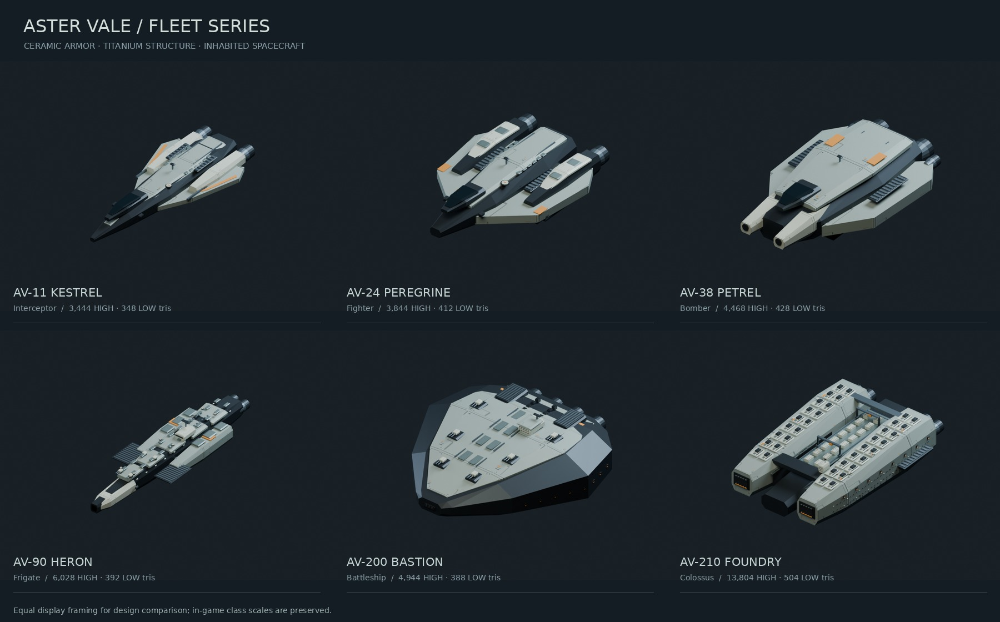

# Aster Vale

Six original, crewed spacecraft built in Blender through the official Blender
Lab MCP server. The [style guide](../../docs/art/aster-vale-ship-style.md) was
committed before implementation (`805d333`). The designs share ceramic armor,
graphite structure, service equipment and restrained amber paint; they do not
reuse meshes, textures, logos or ship designs from the reference games.



| Class | Hull | HIGH triangles | LOW triangles | Runtime scale |
| --- | --- | ---: | ---: | ---: |
| Interceptor | AV-11 Kestrel | 3,444 | 348 | 1 |
| Fighter | AV-24 Peregrine | 3,844 | 412 | 1.3 |
| Bomber | AV-38 Petrel | 4,468 | 428 | 2 |
| Frigate | AV-90 Heron | 6,028 | 392 | 9 |
| Battleship | AV-200 Bastion | 4,944 | 388 | 20 |
| Colossus | AV-210 Foundry | 13,804 | 504 | 20 |

[Compare both detail levels](previews/lod-comparison.jpg).

[Compare the capital silhouettes](previews/capital-comparison.jpg): Heron keeps
its long segmented escort spine, Bastion has a single broad angular shield hull
with an offset command island, and Foundry has parallel industrial shoulders around a
working cargo trench. Foundry's smaller roof modules, two rows of habitation
windows, airlocks, galleries and cargo gantries convey its scale. Those fittings
are HIGH-only; its class scale and inexpensive LOW silhouette are retained.

The LOW hulls are independently authored reductions: cabin, wings, nacelles,
armor blocks and engine arrangements remain; ribs, fittings, turrets and service
panels disappear. The distant tactical triangle remains the third
representation. The GPU switches geometric LOD by projected diameter with
hysteresis; see [scene rendering](../../docs/scene-ship-rendering.md).

Each GLB contains one static mesh/primitive and one material, with +Z forward and
+Y up. HIGH and LOW share the same engineering datum and normalization sphere
(radius 1), so switching detail cannot change position, scale or camera framing.
The capital classes intentionally retain their existing equal visual radius.
The Colossus has a twin-shoulder carrier silhouette; simulation size and ship tuning
have not been changed to impose fictional metric dimensions.

The 512×512 palette contains ceramic panel seams and small service markings.
The 64×64 surface map uses glTF roughness in G and metallic in B. All twelve GLBs
embed identical images; the runtime merges geometry by LOD and uploads one
material set per LOD. Team tint affects the amber paint; selection highlights
the edges while keeping the hull materials visible. No downloaded art is used.

## Editable source and regeneration

Open [aster-vale.blend](aster-vale.blend) in Blender. `AV_Engineering` contains a
named collection per class, HIGH/LOW objects and component vertex groups. The
smallest hull is shown initially; reveal the other objects to edit them. Native
Blender axes are -Y forward, +Z up; glTF export converts those to the runtime axes.
The `nominal_radius_m` property is an art reference (16 m × class scale), not a
simulation unit conversion. The default scene that was open before authoring is
preserved separately.

The deterministic geometry and export code is in [scripts/art](../../scripts/art/).
The authoring session used Blender 5.2.2 LTS, the already-running official add-on,
and the official `blender-mcp` 1.0.2 server from
[Blender Lab](https://projects.blender.org/lab/blender_mcp). A temporary isolated
Python environment was used; no third-party replacement add-on was installed.

To regenerate through MCP, install the official server into your own virtual
environment, enable the official add-on in Blender, and run:

```sh
python3 scripts/art/blender_mcp_client.py --server /path/to/bin/blender-mcp --file /path/to/build-ships.py
```

The `build-ships.py` request contains:

```python
import runpy
module = runpy.run_path('/absolute/path/to/galaxy/scripts/art/generate_aster_vale.py')
result = module['build']()
```

The helper performs the MCP initialize handshake and calls the discovered
`execute_blender_code` tool; the official server forwards it to the Blender
add-on. Only scenes/objects prefixed `AV_` are replaced on regeneration. Run
`module['render_previews']()` for HIGH or `module['render_previews'](low=True)`
for LOW in a subsequent request, wrapping the list as
`result = {'previews': module['render_previews'](low=True)}` for MCP.
`aster_contact_sheet.py` composes the actual
renders and LOD comparison using Pillow and the system DejaVu Sans font.
Pass `keys=['battleship'], view='top'` or `view='aft'` to `render_previews` for
the additional silhouette-review views.

Validation reads all shipped GLBs, checks bounds/normals/index ranges/shared
images, and draws all six class/LOD partitions on real WebGPU. The pixel oracle
compares compacted draws with the unculled class reference. These are correctness
checks; the studio renders and tests are not whole-game FPS qualification.
